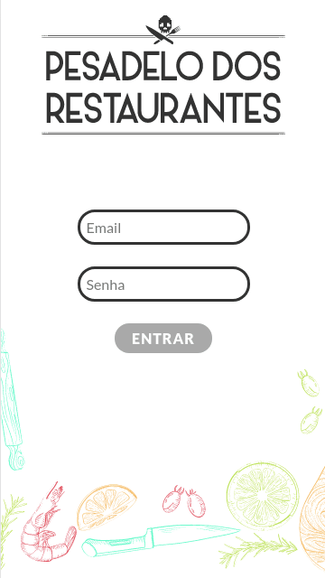
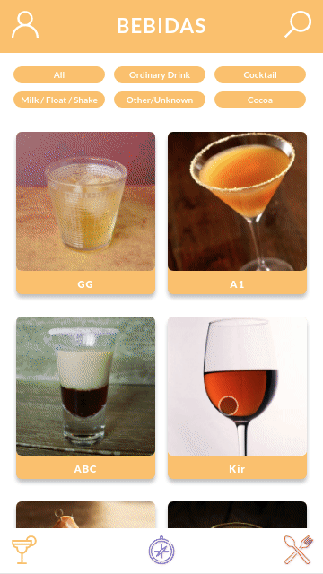
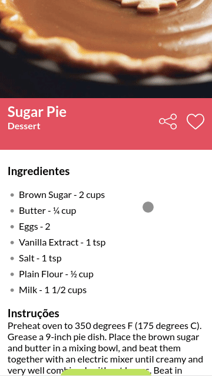
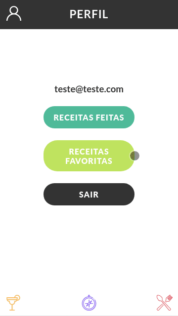

<h1 align="center"></h1>
 
O <strong>Recipe</strong> é um app de de receitas, em sua versão mobile first e web, o intuito do app e ajudar as pessoas a melhorar na cozinha, tendo como favoritar suas receitas, ver elas sendo feitas na tela de progresso e ver detalhes da receita, com video de como fazer e dicas na tela de progresso.
  
<h1>
 <a href="https://recipe-beta.vercel.app/">Deploy Aqui!</a>
</h1>

### 🛠 Tecnologias

As seguintes ferramentas foram usadas na construção do projeto:

- [x] REACT
- [x] CONTEXT API
- [x] HOOKS
- [x] RTL
- [x] SPA
- [x] API
- [x] ESLINT
- [x] ROUTER
- [x] FIGMA
- [x] HTML5
- [x] CSS3

### 💻 Desenvolvedores:

<a width="50px;">
Gabriel Castro 🥇  
      
</a>  
<a width="50px;">  
 Guilherme Pereira 🥇  
    
</a>
<a width="50px;">
 Julio Thosi 🥇  
      
</a>  
<a width="50px;">   
 Thiago Cavalcante 🥇  
        
</a>
<a width="50px;">
 Diogo Augusto 🥇  
      
</a>

 
